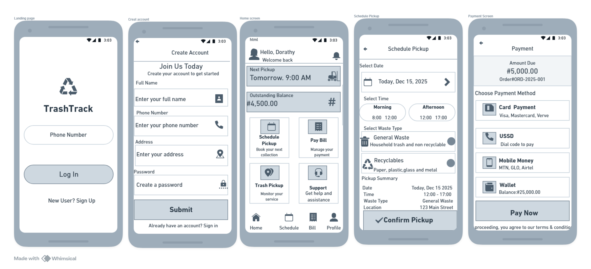
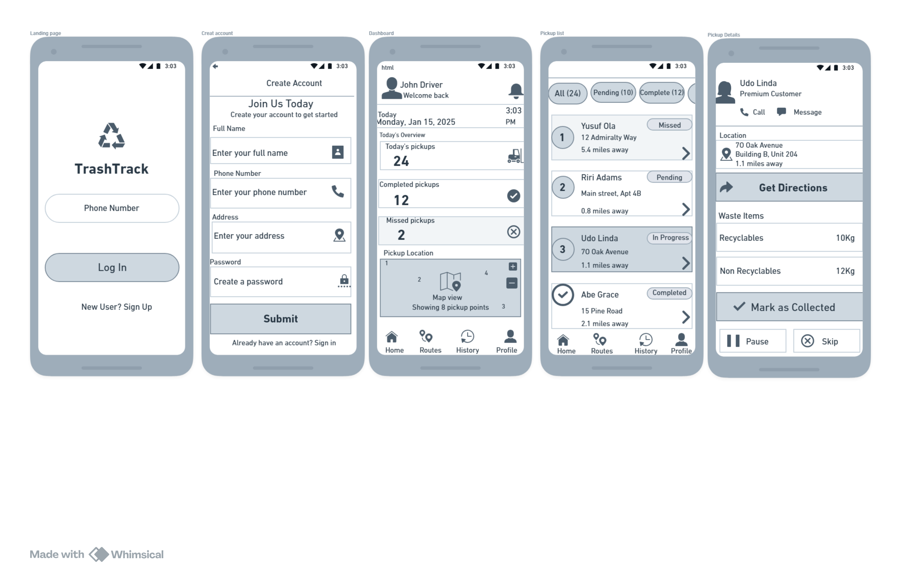

# TrashTrack 
### Smarter, Cleaner, Connected Waste Management

## What It Does
TrashTrack is a digital waste management platform that connects households, businesses, and waste operators to make waste collection efficient, transparent, and eco-friendly.

## Why It Matters
In many cities, waste collection is irregular and not trackable . TrashTrack solves this by enabling real-time pickup tracking, digital payments, and recycling rewards — making waste management more sustainable and accountable.

## Who It’s For
- **Households**: Schedule and monitor pickups.
- **Businesses**: Manage waste contracts and compliance.
- **Operators**: Optimize routes and monitor performance.
- **Regulators**: Track collection data and enforce policies.

## Key Features
-  Real-time GPS tracking of trucks  
-  Secure digital payments  
-  Issue reporting (missed pickups, illegal dumping)  
-  Recycling rewards for users  
-  Analytics dashboard for operators  

## Technologies (Planned)
- Frontend: React.js, Tailwind CSS  
- Backend: Node.js (Express)  
- Database: MongoDB  
- Hosting: AWS / Render  

## Wireframes

Below are early wireframes showing the TrashTrack User and Collector Flow.

